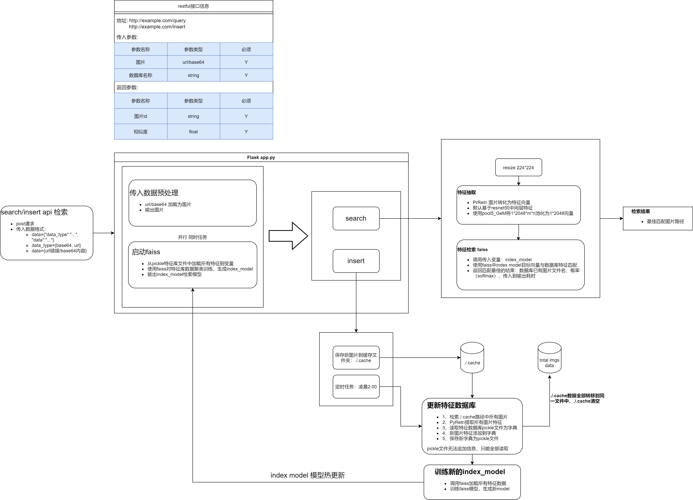

# ImageRetrieval

基于Flask RESTful api的图像特征检索方案，api传入url/base64即可在毫秒内返回数据库匹配结果，主要用于图像去重，后续拓展使用范围

---

### 代码文件说明：

- 这是最近在做的一个开源项目
- [PyRetri](https://github.com/PyRetri/PyRetri)文件夹为开源项目源码（本项目仅调用特征提取模块），其余为自己编写

---

### 1. 项目说明：

- 本项目基于开源框架[PyRetri](https://github.com/PyRetri/PyRetri)进行二次开发，同时结合facebook开源项目[Facebook AI Similarity Search](https://github.com/facebookresearch/faiss)，设计出基于Flask的RESTful api接口，目的是为了解决以下几个场景问题：
  - 1）本地已经存储大规模专业图像数据集，新增图像可能与现有数据存在重合或高度相似，需要快速剔除；
  - 2）网络爬虫图像去重；
  - 3）本地存储大量冗余图片去重。

### 2. 产品介绍：

- 本框架优势：
  - 方便易用：基于Flask—RESTful设计，只需将url或base64数据传入api，即可快速得到匹配结果
  - 准确度高：基于深度学习提取特征，相比于传统[感知哈希算法去重dHash](https://zhuanlan.zhihu.com/p/88696039)准确率更高
  - 速度快：基于faiss开发，能应对百万级数据量特征做出毫秒级快速匹配
  - 多用户并发：基于Flask开发，可同时为多用户并发提供服务
  - 检索模块自更新：集成检索模块自更新功能，自动处理新增数据并完成检索模型更新，一次部署后续轻松
- 后续优化：
  - 检索准确度基于现有PyRetri特征提取功能，主要依赖于ResNet50特征抽取，对复杂图片或者高度相似图片存在一定程度的匹配失败问题
  - 基于现有Flask并发，高并发能力较弱
- 启动方式：
  - 服务代码：app.py文件
  - api测试代码：test_script/link_flask.py
- 目前进展：整体框架demo测试结束，后续进行逻辑优化与改进

### 3. 项目流程图框架

- 

- #### 代码：[github](https://github.com/wufuming3711/ImageRetrieval)

- #### 测试结果：

  - ```bsah
    [INFO] 单张图片转化为特征向量耗时=0.00s
    [INFO] 从pickle数据文件中加载所有特征耗时=0.11s
    
    [INFO] 使用倒排文件查询
    [INFO] 模型到排序耗时=0.06s
    [INFO] 时间检索耗时=0.02s
    [INFO] 特征检索耗时=0.15s
    [[159.58403]]
    [INFO] 预测结果：229.jpg   检测图片：229.jpg
    ----------------------------------------------------------------------------
    [INFO] 单张图片转化为特征向量耗时=0.00s
    [INFO] 从pickle数据文件中加载所有特征耗时=0.16s
    
    [INFO] 使用倒排文件查询
    [INFO] 模型到排序耗时=0.05s
    [INFO] 时间检索耗时=0.02s
    [INFO] 特征检索耗时=0.16s
    [[146.23242]]
    [INFO] 预测结果：801.jpg   检测图片：436.jpg
    ----------------------------------------------------------------------------
    [INFO] 单张图片转化为特征向量耗时=0.00s
    [INFO] 从pickle数据文件中加载所有特征耗时=0.10s
    
    [INFO] 使用倒排文件查询
    [INFO] 模型到排序耗时=0.05s
    [INFO] 时间检索耗时=0.02s
    [INFO] 特征检索耗时=0.13s
    [[186.39629]]
    [INFO] 预测结果：927.jpg   检测图片：927.jpg
    ----------------------------------------------------------------------------
    [INFO] 单张图片转化为特征向量耗时=0.00s
    [INFO] 从pickle数据文件中加载所有特征耗时=0.13s
    
    [INFO] 使用倒排文件查询
    [INFO] 模型到排序耗时=0.06s
    [INFO] 时间检索耗时=0.02s
    [INFO] 特征检索耗时=0.15s
    [[236.16458]]
    [INFO] 预测结果：814.jpg   检测图片：814.jpg
    ----------------------------------------------------------------------------
    [INFO] 单张图片转化为特征向量耗时=0.00s
    [INFO] 从pickle数据文件中加载所有特征耗时=0.13s
    
    [INFO] 使用倒排文件查询
    [INFO] 模型到排序耗时=0.04s
    [INFO] 时间检索耗时=0.01s
    [INFO] 特征检索耗时=0.12s
    [[246.01143]]
    [INFO] 预测结果：488.jpg   检测图片：488.jpg
    ----------------------------------------------------------------------------
    [INFO] 单张图片转化为特征向量耗时=0.00s
    [INFO] 从pickle数据文件中加载所有特征耗时=0.13s
    
    [INFO] 使用倒排文件查询
    [INFO] 模型到排序耗时=0.05s
    [INFO] 时间检索耗时=0.02s
    [INFO] 特征检索耗时=0.14s
    [[173.83035]]
    [INFO] 预测结果：60ac8a4eae1ea695816.jpg   检测图片：60ac8a4eae1ea695816.jpg
    ----------------------------------------------------------------------------
    [INFO] 单张图片转化为特征向量耗时=0.00s
    [INFO] 从pickle数据文件中加载所有特征耗时=0.11s
    
    [INFO] 使用倒排文件查询
    [INFO] 模型到排序耗时=0.06s
    [INFO] 时间检索耗时=0.02s
    [INFO] 特征检索耗时=0.16s
    [[156.87775]]
    [INFO] 预测结果：60acabe767f7f165042.jpg   检测图片：901.jpg
    ----------------------------------------------------------------------------
    [INFO] 单张图片转化为特征向量耗时=0.00s
    [INFO] 从pickle数据文件中加载所有特征耗时=0.12s
    
    [INFO] 使用倒排文件查询
    [INFO] 模型到排序耗时=0.05s
    [INFO] 时间检索耗时=0.02s
    [INFO] 特征检索耗时=0.15s
    [[242.79527]]
    [INFO] 预测结果：516.jpg   检测图片：516.jpg
    ----------------------------------------------------------------------------
    [INFO] 单张图片转化为特征向量耗时=0.00s
    [INFO] 从pickle数据文件中加载所有特征耗时=0.15s
    
    [INFO] 使用倒排文件查询
    [INFO] 模型到排序耗时=0.05s
    [INFO] 时间检索耗时=0.02s
    [INFO] 特征检索耗时=0.16s
    [[146.28818]]
    [INFO] 预测结果：893.jpg   检测图片：893.jpg
    ----------------------------------------------------------------------------
    [INFO] 单张图片转化为特征向量耗时=0.00s
    [INFO] 从pickle数据文件中加载所有特征耗时=0.10s
    
    [INFO] 使用倒排文件查询
    [INFO] 模型到排序耗时=0.05s
    [INFO] 时间检索耗时=0.01s
    [INFO] 特征检索耗时=0.13s
    [[299.39297]]
    [INFO] 预测结果：206.jpg   检测图片：206.jpg
    ----------------------------------------------------------------------------
    ```

    
